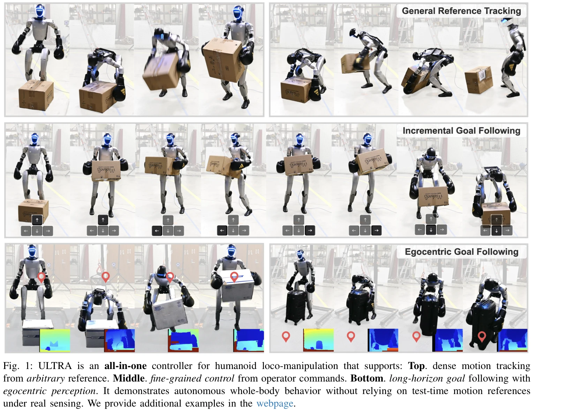
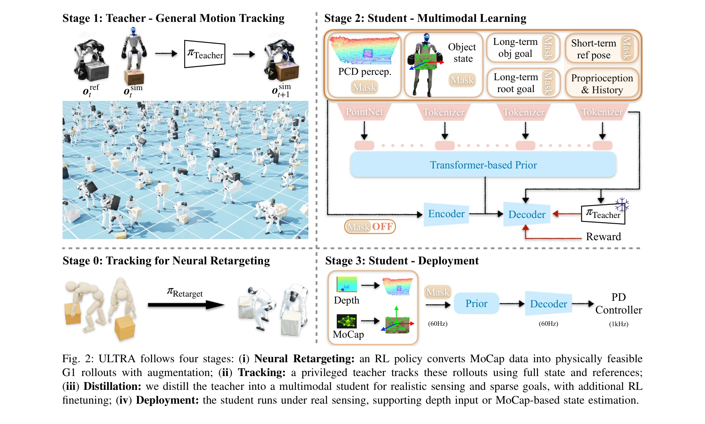

# ULTRA: Unified Multimodal Control for Autonomous Humanoid Whole-Body Loco-Manipulation

> **저자**: Xialin He, Sirui Xu, Xinyao Li, Runpei Dong, Liuyu Bian, Yu-Xiong Wang, Liang-Yan Gui | **날짜**: 2026-03-03 | **URL**: [https://arxiv.org/abs/2603.03279](https://arxiv.org/abs/2603.03279)

---

## Essence

*Fig. 1: ULTRA is an all-in-one controller for humanoid loco-manipulation that supports: Top. dense motion tracking*

물리 기반 신경 retargeting과 unified multimodal controller를 결합하여 humanoid 로봇이 dense reference tracking과 sparse goal-conditioning을 모두 지원하며, egocentric 시각 인지 기반 자율적 전신 loco-manipulation을 수행할 수 있는 프레임워크이다.

## Motivation

- **Known**: Humanoid 로봇의 motion tracking 기술은 발전했으나, kinematic retargeting은 접촉이 많은 작업에서 물리적 일관성을 유지하지 못하고, 기존 컨트롤러는 reference tracking 또는 goal-conditioning 중 하나에만 특화되어 있다.
- **Gap**: 물리적으로 일관성 있는 대규모 retargeting 방법의 부재와 diverse 조건 신호(dense reference, sparse goal, 다양한 센싱 모달리티)를 하나의 통일된 정책으로 처리하는 아키텍처의 부족이 실제 배포 환경에서 자율성을 제한한다.
- **Why**: Humanoid 로봇이 비정형 환경에서 실제로 유용하려면 정해진 reference 없이 perception과 고수준 작업 명세로부터 행동을 생성해야 하며, 이는 현재의 reference-tracking 중심 접근법의 한계를 극복하는 데 필수적이다.
- **Approach**: Physics-driven neural retargeting으로 MoCap 데이터를 humanoid embodiment에 물리적으로 타당하게 전환하고, 통일된 multimodal controller를 teacher-student distillation과 RL finetuning으로 학습하여 dense reference와 sparse goal을 모두 지원하도록 한다.

## Achievement

*Fig. 1: ULTRA is an all-in-one controller for humanoid loco-manipulation that supports: Top. dense motion tracking*

- **Physics-driven neural retargeting**: Simulation-constrained optimization과 RL을 통해 kinematic retargeting보다 contact-rich 작업에서 물리적 일관성을 보장하며 대규모 dataset에서 scalable하게 동작
- **Unified multimodal controller**: Availability masking과 tokenization을 통해 단일 정책이 dense reference tracking, sparse long-horizon goal following, blind/MoCap/depth perception 등 다양한 조건과 센싱 모달리티를 일관되게 처리
- **Variational skill bottleneck**: 모션 스킬을 compact latent space로 압축하여 sparse goal 하에서의 모호성을 해결하고 coherent motion 유지
- **Real-world validation**: Unitree G1 humanoid에서 test-time reference 없이 egocentric perception 기반 autonomous whole-body loco-manipulation 달성, tracking-only baseline 능가

## How

*Fig. 2: ULTRA follows four stages: (i) Neural Retargeting: an RL policy converts MoCap data into physically feasible*

- **Stage 1 - Neural Retargeting**: Retargeting policy를 RL로 학습하여 kinematic constraint, dynamic constraint, contact constraint를 동시에 만족하는 physically feasible trajectory 생성
- **Stage 2 - Zero-shot augmentation**: 학습된 retargeting policy를 활용하여 object와 motion의 scale을 변화시켜 dataset 확장
- **Stage 3 - Teacher distillation**: Privileged universal tracker를 학습한 후, 이를 teacher로 삼아 diverse goal specification을 지원하는 student controller 학습
- **Stage 4 - RL finetuning**: Variational skill bottleneck과 RL을 통해 out-of-distribution scenario에서의 robustness 증진 및 interaction-state coverage 확장
- **Availability masking**: Reference modality와 goal specification이 부분적으로만 제공될 때도 정책이 안정적으로 동작하도록 masking 적용

## Originality

- Simulation-constrained optimization과 RL을 활용한 scalable physics-driven retargeting 방식이 기존의 per-trajectory 최적화나 kinematic 방식과 차별화
- Single unified policy에서 dense reference tracking과 sparse goal-conditioning을 모두 지원하는 multimodal control 아키텍처의 설계
- Availability masking을 통해 부분적 또는 변동하는 조건 신호를 일관되게 처리하는 메커니즘
- Teacher-student distillation 이후 RL finetuning으로 closed-loop goal stabilization을 유도하는 two-stage learning 파라다임

## Limitation & Further Study

- Retargeting 성능이 source MoCap의 품질에 의존하며, 매우 드문 또는 extreme 모션의 경우 coverage 한계 존재 가능
- Egocentric depth perception 기반 객체 상태 추론의 정확도 한계와 이에 따른 control 성능 저하 가능성
- RL finetuning의 computational cost와 real-world 학습의 safety 관련 문제 미처리
- 평가가 주로 single humanoid embodiment(Unitree G1)에 한정되어 다양한 형태의 humanoid에의 generalization 검증 부족
- 후속 연구로 다중 객체 manipulation, dynamic obstacles, long-horizon planning과의 통합, 그리고 cross-embodiment generalization 필요

## Evaluation

- Novelty: 4/5
- Technical Soundness: 4/5
- Significance: 4/5
- Clarity: 4/5
- Overall: 4/5

**총평**: 이 논문은 humanoid loco-manipulation의 두 가지 근본적인 병목(물리적 retargeting과 통합 컨트롤)을 체계적으로 해결하며, physics-driven retargeting과 multimodal distillation의 조합으로 실제 배포 환경에서의 자율성을 크게 향상시킨다. 특히 unified framework로 diverse 조건 신호를 처리하고 real-world 평가를 제시한 점에서 학술적 및 실용적 의의가 높다.

## Related Papers

- 🏛 기반 연구: [[papers/1981_HMC_Learning_Heterogeneous_Meta-Control_for_Contact-Rich_Loc/review]] — HMC의 heterogeneous meta-control 기법이 ULTRA의 unified multimodal controller에서 서로 다른 제어 모드를 통합하는 기반 방법론을 제공합니다.
- 🔄 다른 접근: [[papers/2166_ULTRA_Unified_Multimodal_Control_for_Autonomous_Humanoid_Who/review]] — ULTRA는 dense tracking과 sparse goal-conditioning을 통합하고 다른 unified control 접근법들은 단일 제어 패러다임에 집중하는 서로 다른 전략입니다.
- 🧪 응용 사례: [[papers/1901_EgoHumanoid_Unlocking_In-the-Wild_Loco-Manipulation_with_Rob/review]] — ULTRA의 unified multimodal control을 EgoHumanoid의 야외 loco-manipulation 환경에 적용하여 더 자연스러운 egocentric 기반 전신 제어를 달성할 수 있습니다.
- 🏛 기반 연구: [[papers/1947_Generalizable_Humanoid_Manipulation_with_3D_Diffusion_Polici/review]] — 3D diffusion policies가 ULTRA의 physics-based neural retargeting에서 복잡한 동작 생성의 핵심 기술적 토대가 됨
- 🔄 다른 접근: [[papers/1974_Hierarchical_Vision-Language_Planning_for_Multi-Step_Humanoi/review]] — hierarchical vision-language planning과 ULTRA의 unified multimodal controller는 다단계 휴머노이드 제어의 서로 다른 패러다임을 제시함
- 🔗 후속 연구: [[papers/2081_LeVERB_Humanoid_Whole-Body_Control_with_Latent_Vision-Langua/review]] — LeVERB의 latent vision-language control에 ULTRA의 egocentric 시각 인지를 통합하면 더 자연스러운 whole-body control 가능
- 🔄 다른 접근: [[papers/1902_EgoMI_Learning_Active_Vision_and_Whole-Body_Manipulation_fro/review]] — 둘 다 자기중심 시각 기반 전신 조작을 다루지만 이 논문은 통합 멀티모달 제어에, EgoMI는 능동 시각과 조작 학습에 중점을 둡니다.
- 🏛 기반 연구: [[papers/1904_EgoVLA_Learning_Vision-Language-Action_Models_from_Egocentri/review]] — 자기중심 비디오에서 비전-언어-행동 모델 학습이 물리 기반 신경 리타겟팅과 통합 멀티모달 제어의 이론적 기반이 됩니다.
- 🔗 후속 연구: [[papers/2013_HumanX_Toward_Agile_and_Generalizable_Humanoid_Interaction_S/review]] — 민첩하고 일반화된 휴머노이드 상호작용 학습이 ULTRA의 자율적 전신 loco-manipulation을 더욱 동적이고 복잡한 환경으로 확장할 수 있습니다.
- 🧪 응용 사례: [[papers/1760_X-Loco_Towards_Generalist_Humanoid_Locomotion_Control_via_Sy/review]] — ULTRA의 통합 multimodal 제어 프레임워크가 X-Loco의 범용 locomotion 기능을 자율적인 whole-body 제어로 확장할 수 있다.
- 🔗 후속 연구: [[papers/1784_A_Unified_and_General_Humanoid_Whole-Body_Controller_for_Ver/review]] — ULTRA의 unified multimodal 제어가 HugWBC의 다양한 보행 행동을 더 포괄적인 자율 시스템으로 확장할 수 있다.
- 🧪 응용 사례: [[papers/1904_EgoVLA_Learning_Vision-Language-Action_Models_from_Egocentri/review]] — EgoVLA의 VLA 모델을 ULTRA의 통합 multimodal 제어 시스템에 적용하면 더 풍부한 언어-행동 매핑이 가능하다.
- 🏛 기반 연구: [[papers/2032_JAEGER_Dual-Level_Humanoid_Whole-Body_Controller/review]] — ULTRA의 통합 멀티모달 제어가 JAEGER의 dual-level 아키텍처에 상체-하체 통합 제어 프레임워크 제공
- 🔗 후속 연구: [[papers/2102_Mobile-TeleVision_Predictive_Motion_Priors_for_Humanoid_Whol/review]] — Mobile-TeleVision의 예측적 프라이어를 ULTRA의 통합 멀티모달 제어로 확장하여 더 포괄적인 전신 제어를 달성할 수 있다.
