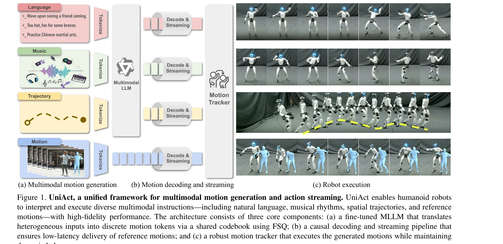
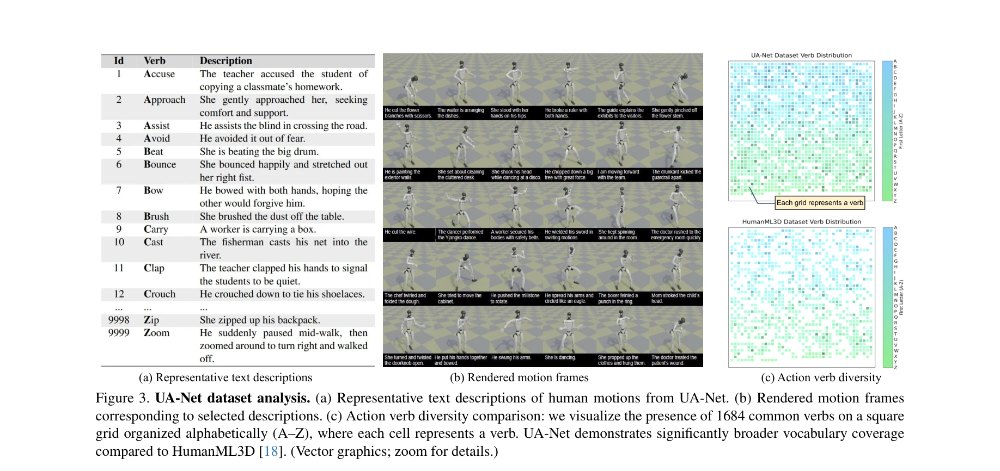
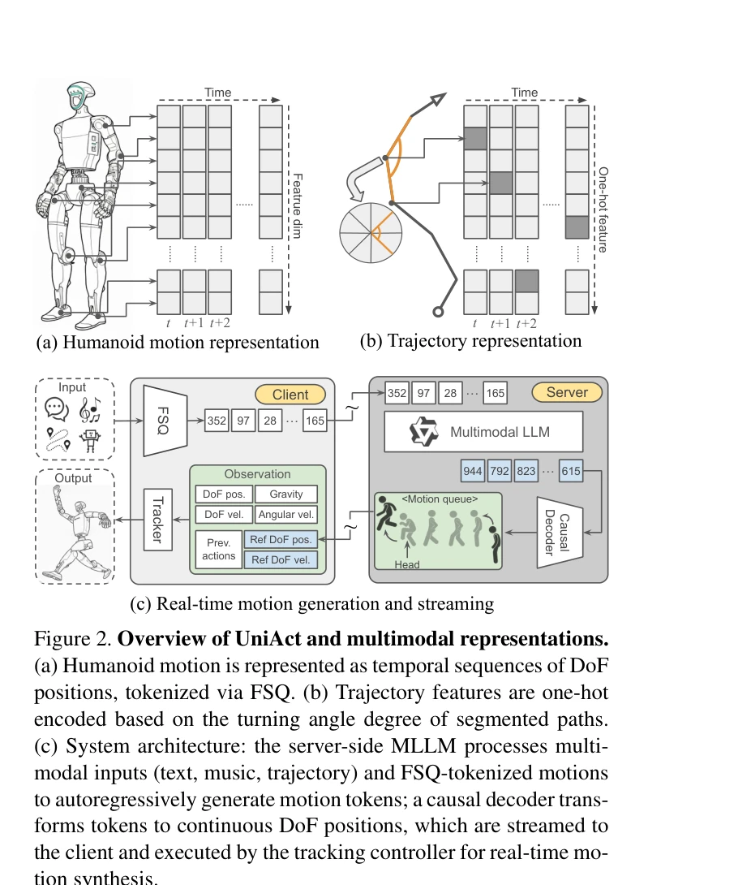

# UniAct: Unified Motion Generation and Action Streaming for Humanoid Robots

> **저자**: Nan Jiang, Zimo He, Wanhe Yu, Lexi Pang, Yunhao Li, Hongjie Li, Jieming Cui, Yuhan Li, Yizhou Wang, Yixin Zhu, Siyuan Huang | **날짜**: 2025-12-30 | **DOI**: [10.48550/arXiv.2512.24321](https://doi.org/10.48550/arXiv.2512.24321)

---

## Essence

*Figure 1. UniAct, a unified framework for multimodal motion generation and action streaming. UniAct enables humanoid rob*

UniAct는 MLLM과 causal streaming pipeline을 결합한 두 단계 프레임워크로, 인간형 로봇이 언어, 음악, 궤적 등 다양한 multimodal 명령을 sub-500ms 지연시간으로 실행할 수 있게 한다.

## Motivation

- **Known**: 인간형 로봇 제어는 저수준 추적과 제어에서 진전했으나, 고수준 multimodal 인식과 전신 실행 간의 격차가 남아있다. 기존 방법들은 end-to-end 매핑이나 계층적 파이프라인 중 하나를 채택하여 real-time 응답성과 명령 이해 간 트레이드오프를 겪고 있다.
- **Gap**: 다양한 modality의 명령을 물리적으로 타당한 움직임으로 안정적이고 실시간으로 변환하는 unified framework가 부재하며, 불완전한 인간 시연에 대한 robustness도 부족하다.
- **Why**: 인간형 로봇의 multimodal instruction following 능력은 일반적 목적의 로봇 어시스턴트 실현에 필수적이며, sub-500ms 응답 지연은 대화형 interaction을 가능하게 한다.
- **Approach**: UniAct는 FSQ를 통해 이질적 입력을 공유 discrete codebook으로 통합하여 cross-modal alignment를 확보하고, MLLM 기반 생성 단계와 causal decoder를 거쳐 robust motion tracker로 실행한다.

## Achievement

*Figure 3. UA-Net dataset analysis. (a) Representative text descriptions of human motions from UA-Net. (b) Rendered motio*

- **Unified multimodal framework**: 언어, 음악, 궤적, reference 동작을 하나의 discrete token 공간으로 통합하여 seamless cross-modal translation 실현
- **Low-latency real-time execution**: Sub-500ms 응답 지연으로 responsive humanoid assistant 구현
- **19% improvement in zero-shot tracking**: 불완전한 reference motion에 대한 zero-shot 추적 성공률 향상
- **Comprehensive evaluation**: 1,000+ 시뮬레이션 시행과 100+ 시간의 실제 로봇 운영을 통한 검증
- **UA-Net benchmark**: 20시간 규모의 multimodal 주석이 달린 고품질 인간형 로봇 동작 데이터셋 제공

## How

*Figure 2. Overview of UniAct and multimodal representations.*

- **FSQ 기반 토큰화**: 텍스트, 음악, 궤적, reference motion을 discrete token 표현으로 변환하여 입력 통일
- **MLLM 기반 생성**: Fine-tuned MLLM이 multimodal 입력을 reasoning하여 motion token sequence 생성
- **Causal streaming decoder**: Next-token prediction 패러다임으로 생성된 토큰을 실시간 명령으로 변환
- **Robust motion tracker**: 생성된 명령을 물리적으로 타당한 움직임으로 실행하며 동적 균형 유지
- **Physically grounded manifold**: Discrete action space로 생성을 물리적으로 실현 가능한 영역에 제약

## Originality

- Humanoid control에서 처음으로 MLLM과 robust tracker를 unified framework로 결합
- FSQ 기반의 shared discrete codebook으로 heterogeneous multimodal inputs의 seamless translation 달성
- Causal streaming pipeline을 통해 diffusion 기반 방법 대비 sub-500ms 지연 실현
- Multimodal annotation이 포함된 대규모 humanoid-specific 데이터셋(UA-Net) 구축

## Limitation & Further Study

- 실제 deployment에서의 추가 hardware 제약이나 환경 perturbation에 대한 robustness 평가 부족
- MLLM의 inference 능력 한계로 인한 복잡한 의미론적 추론의 제한 가능성
- Cross-embodiment generalization 성능 미평가 — 다른 humanoid 형태에 대한 일반화 능력 미검증
- UA-Net의 20시간 규모는 대규모 데이터셋 기준으로 여전히 제한적일 수 있음
- **후속 연구**: OOD 상황에 대한 adaptability 강화, 다양한 humanoid morphology에 대한 transfer learning 연구, 더 큰 규모의 multimodal dataset 구축 필요

## Evaluation

- Novelty: 4/5
- Technical Soundness: 3/5
- Significance: 4/5
- Clarity: 4/5
- Overall: 4/5

**총평**: UniAct는 MLLM과 robust tracking을 unified framework로 통합하여 실제 humanoid robot에서 multimodal instruction following을 low latency로 달성한 의미 있는 연구이며, UA-Net 데이터셋 기여와 함께 embodied AI 분야에서 중요한 진전을 나타낸다.
