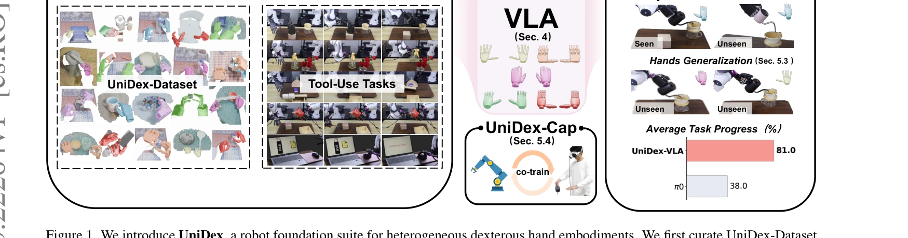
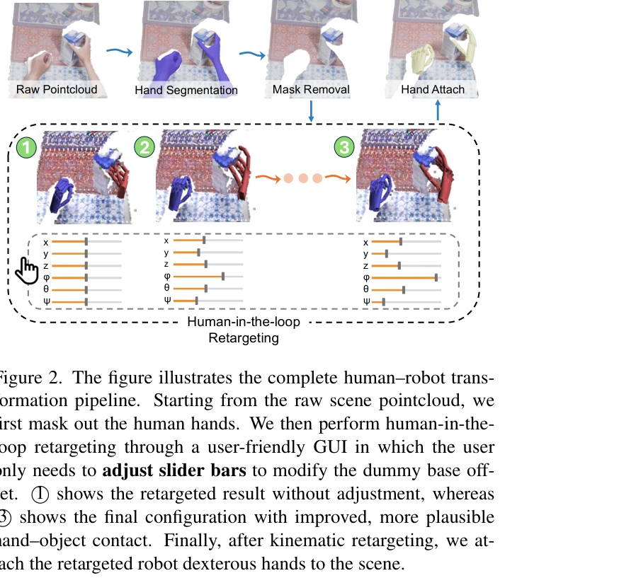

# UniDex: A Robot Foundation Suite for Universal Dexterous Hand Control from Egocentric Human Videos

> **저자**: Gu Zhang, Qicheng Xu, Haozhe Zhang, Jianhan Ma, Long He, Yiming Bao, Zeyu Ping, Zhecheng Yuan, Chenhao Lu, Chengbo Yuan, Tianhai Liang, Xiaoyu Tian, Maanping Shao, Feihong Zhang, Mingyu Ding, Yang Gao, Hao Zhao, Hang Zhao, Huazhe Xu | **날짜**: 2026-03-23 | **URL**: [https://arxiv.org/abs/2603.22264](https://arxiv.org/abs/2603.22264)

---

## Essence

*Figure 1. We introduce UniDex, a robot foundation suite for heterogeneous dexterous hand embodiments. We first curate Un*

인간 자기중심 비디오로부터 8종 로봇 핸드에 대한 범용 손재주 제어를 위해 50K+ 궤적 데이터셋(UniDex-Dataset), 통합 액션 공간(FAAS), 3D VLA 정책(UniDex-VLA)을 제시하는 로봇 파운데이션 스위트이다.

## Motivation

- **Known**: Gripper 기반 VLA 모델들은 다양한 작업에서 성공했으나, 손재주 있는 손 제어를 위한 파운데이션 모델은 희소하고 대규모 데이터셋이 부족하다. 기존 손재주 손 연구는 특정 작업이나 하드웨어에 맞춤화되어 있다.
- **Gap**: 손재주 손 제어는 (1) 수집 비용이 높은 실로봇 데이터, (2) 손 형태의 이질성으로 인한 전이 어려움, (3) 고차원 제어 공간의 복잡성으로 인해 gripper 기반 접근법을 직접 적용할 수 없다.
- **Why**: 도구 사용과 같은 일상적 작업은 손재주 손이 필수적이며, 손재주 손 제어의 파운데이션 모델은 로봇 조작의 일반화와 확장성을 크게 향상시킬 수 있다.
- **Approach**: 인간 비디오를 로봇 실행 가능한 궤적으로 변환하는 human-in-the-loop retargeting 절차를 개발하여 대규모 사전학습 데이터셋을 구축하고, Function–Actuator–Aligned Space(FAAS)를 통해 이질적 손 간 전이를 가능하게 하며, UniDex-VLA를 사전학습 후 미세조정하여 범용 정책을 구현한다.

## Achievement

*Figure 1. We introduce UniDex, a robot foundation suite for heterogeneous dexterous hand embodiments. We first curate Un*

- **UniDex-Dataset**: 8개 손(6-24 DoF)에 걸친 50K+ 궤적, 9M 프레임으로 구성된 첫 대규모 다중 손 형태 데이터셋 제공
- **FAAS & UniDex-VLA**: 기능 중심 통합 액션 공간과 3D VLA 정책으로 실로봇 벤치마크에서 평균 81% 작업 진행률 달성 (π0의 38% 대비 대폭 향상)
- **강한 일반화**: 공간적, 객체, 제로샷 크로스-핸드 일반화를 모두 시연하며 미학습 손에 대한 전이 학습 성공
- **Human–Robot Co-training**: UniDex-Cap을 통해 인간 데이터로 사전학습하고 소량의 로봇 데이터로 미세조정하여 비용 절감 실증

## How

*Figure 2. The figure illustrates the complete human–robot trans-*

- 인간 자기중심 RGB-D 비디오에서 fingertip 기반 inverse kinematics와 대화형 조정을 결합한 human-in-the-loop retargeting으로 인간 궤적을 로봇 실행 궤적으로 변환
- 시각적 불일치 감소를 위해 인간 손을 마스킹하고 retarget된 로봇 손을 pointcloud에 삽입하여 시각-운동 도메인 갭 축소
- Function–Actuator–Aligned Space(FAAS)를 정의하여 기능적으로 유사한 액추에이터를 공유 좌표에 매핑, 포스트프로세싱 없이 크로스-핸드 전이 가능
- UniDex-Dataset에서 사전학습하고 작업 데모로 미세조정하는 3D VLA 정책 개발
- RGB-D 스트림과 인간 손 포즈를 동기화하여 기록하고 같은 변환 파이프라인으로 로봇 궤적 생성하는 UniDex-Cap 포터블 캡처 시스템 설계

## Originality

- 처음으로 8개 이질적 손 형태를 통합한 대규모 다중 손 데이터셋 구축 및 공개적 확장 프로토콜 제공
- 기능 중심의 Function–Actuator–Aligned Space(FAAS) 제안으로 손 형태 이질성을 효과적으로 처리하고 포스트프로세싱 없이 전이 가능
- 인간 비디오를 로봇 사전학습 데이터로 직접 변환하는 체계적 파이프라인으로 데이터 수집 비용 대폭 절감
- Human–robot co-training의 정량적 평가를 통해 인간 데이터가 실로봇 데모를 부분 대체 가능함을 실증

## Limitation & Further Study

- Retargeting 절차가 human-in-the-loop 방식으로 수동 개입이 필요하여 완전 자동화에는 미흡할 수 있음
- 평가가 5개 도구 사용 작업과 2개 손에 한정되어 더 광범위한 작업과 손 형태에 대한 검증 필요
- Real-world 테스트에서 물리적 손상이나 장애 상황에 대한 강건성 평가 부족
- 미세조정 단계에서 필요한 로봇 데모의 최소 필요량과 인간 데이터 비율의 최적화에 대한 더 깊은 분석 필요
- 향후 더 많은 손 형태와 실생활 조작 작업을 추가하여 데이터셋 확장 및 다양한 도메인에서의 전이 학습 성능 검증

## Evaluation

- Novelty: 4/5
- Technical Soundness: 3/5
- Significance: 4/5
- Clarity: 4/5
- Overall: 4/5

**총평**: UniDex는 손재주 로봇 손 제어를 위한 첫 포괄적 파운데이션 스위트로, 대규모 다중 손 데이터셋, 혁신적인 FAAS 액션 공간, 강력한 3D VLA 정책을 통합하여 일반화와 전이 학습에서 뛰어난 성과를 달성했다.

## Related Papers

- 🏛 기반 연구: [[papers/1758_WHOLE_World-Grounded_Hand-Object_Lifted_from_Egocentric_Vide/review]] — 자기중심 비디오에서 전신 손-객체 상호작용 학습의 기본 기술이 UniDex의 범용 손재주 제어에 적용된다.
- 🔄 다른 접근: [[papers/1867_DexCap_Scalable_and_Portable_Mocap_Data_Collection_System_fo/review]] — 인간 자기중심 비디오 기반 학습 대신 확장 가능한 모캡 데이터 수집을 통한 손재주 조작 접근법이다.
- 🔗 후속 연구: [[papers/2014_HumDex_Humanoid_Dexterous_Manipulation_Made_Easy/review]] — 단일 휴머노이드 손재주를 8종 로봇 핸드에 대한 범용 제어로 확장한 발전된 파운데이션 스위트이다.
- 🏛 기반 연구: [[papers/1900_EgoDex_Learning_Dexterous_Manipulation_from_Large-Scale_Egoc/review]] — EgoDex의 large-scale egocentric manipulation learning이 UniDex의 인간 자기중심 비디오 기반 dexterous control의 데이터 기반을 제공함
- 🔄 다른 접근: [[papers/1967_HandX_Scaling_Bimanual_Motion_and_Interaction_Generation/review]] — HandX의 bimanual motion generation과 UniDex의 8종 로봇핸드 universal control은 손재주 제어의 서로 다른 일반화 접근법임
- 🔗 후속 연구: [[papers/1631_RAPID_Hand_A_Robust_Affordable_Perception-Integrated_Dextero/review]] — RAPID Hand의 affordable dexterous design에 UniDex의 FAAS 통합 액션 공간을 적용하면 더 접근 가능한 universal hand control 가능
- 🏛 기반 연구: [[papers/2114_Object-Centric_Dexterous_Manipulation_from_Human_Motion_Data/review]] — object-centric manipulation learning이 UniDex의 3D VLA policy에서 물체 중심 dexterous control의 이론적 토대가 됨
- 🔄 다른 접근: [[papers/1869_DexMimicGen_Automated_Data_Generation_for_Bimanual_Dexterous/review]] — 둘 다 이중 손재주 조작을 다루지만 이 논문은 8종 로봇 핸드 범용 제어에, DexMimicGen은 자동화된 이중 손재주 데이터 생성에 중점을 둡니다.
- 🔗 후속 연구: [[papers/2075_Learning_Visuotactile_Skills_with_Two_Multifingered_Hands/review]] — 두 개의 다중 손가락 핸드를 사용한 시각-촉각 기술 학습이 UniDex의 범용 손재주 제어를 촉각 피드백을 포함한 더 정교한 조작으로 확장할 수 있습니다.
- 🏛 기반 연구: [[papers/1659_RUKA_Rethinking_the_Design_of_Humanoid_Hands_with_Learning/review]] — UniDex의 범용 민첩한 조작 기술이 RUKA hand의 학습 기반 제어 시스템에 적용될 수 있다
- 🏛 기반 연구: [[papers/1744_Unleashing_Humanoid_Reaching_Potential_via_Real-world-Ready/review]] — 통합된 다양한 손재주 처리를 위한 로봇 기반 스위트의 개념을 휴머노이드 도달 공간으로 확장하여 Real-world-Ready Skill Space를 구현했다.
- 🏛 기반 연구: [[papers/1803_Antagonistic_Bowden-Cable_Actuation_of_a_Lightweight_Robotic/review]] — universal dexterous handling의 기반 기술을 경량 Bowden 케이블 구동 로봇 손에서 찾을 수 있습니다.
- 🔗 후속 연구: [[papers/1824_BiGym_A_Demo-Driven_Mobile_Bi-Manual_Manipulation_Benchmark/review]] — bi-manual manipulation 벤치마크를 universal dexterous handling을 위한 robot foundation suite로 확장한다.
- 🏛 기반 연구: [[papers/1873_Dexterous_Teleoperation_of_20-DoF_ByteDexter_Hand_via_Human/review]] — UniDex의 범용 정교한 손 조작 로봇 기반이 ByteDexter Hand의 20-DoF 텔레오퍼레이션에 필요한 다양한 조작 기술과 제어 방법론을 제공한다.
- 🔗 후속 연구: [[papers/1967_HandX_Scaling_Bimanual_Motion_and_Interaction_Generation/review]] — UniDex의 universal dexterous handling이 HandX의 bimanual interaction generation을 더욱 발전시킵니다.
- 🔗 후속 연구: [[papers/2083_Lightning_Grasp_High_Performance_Procedural_Grasp_Synthesis/review]] — UniDex의 범용적 정교한 손 조작을 위해 Lightning Grasp의 Contact Field 기반 고성능 파지 합성 기술이 핵심적으로 확장될 수 있다.
