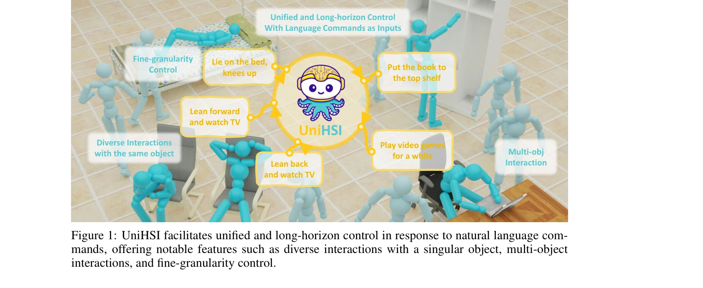
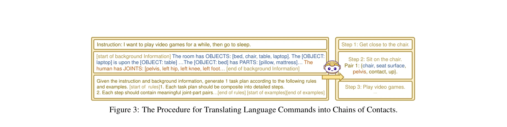

# Unified Human-Scene Interaction via Prompted Chain-of-Contacts

> **저자**: Zeqi Xiao, Tai Wang, Jingbo Wang, Jinkun Cao, Wenwei Zhang, Bo Dai, Dahua Lin, Jiangmiao Pang | **날짜**: 2023-09-14 | **URL**: [https://arxiv.org/abs/2309.07918](https://arxiv.org/abs/2309.07918)

---

## Essence

*Figure 2: Comprehensive Overview of UniHSI. The entire pipeline comprises two principal com-*

UniHSI는 Large Language Model을 활용하여 자연어 명령을 Chain of Contacts (CoC)로 변환하고, 통합 컨트롤러를 통해 다양한 인간-장면 상호작용을 물리적으로 타당하게 수행하는 프레임워크를 제안한다.

## Motivation

- **Known**: 기존 Human-Scene Interaction 연구들은 동작 품질과 물리적 타당성 향상에 초점을 맞춰왔으며, 최근 물리 기반 방법들이 물리 정확성을 보장하려 시도하고 있다.
- **Gap**: 기존 방법들은 제한된 상호작용만 지원하거나 각 작업마다 별도의 정책 네트워크가 필요하며, 대규모 주석 데이터를 요구하고 장기간 상호작용 전환을 지원하지 못한다.
- **Why**: embodied AI와 VR 분야에서 실제 적용을 위해서는 자연어를 통한 직관적인 제어, 다양한 상호작용의 통합 처리, 그리고 실시간 성능이 필수적이다.
- **Approach**: Chain of Contacts라는 새로운 상호작용 표현 형식을 정의하여 상호작용을 인간-객체 접촉 쌍의 순서열로 모델링하고, LLM Planner와 Unified Controller라는 두 단계 파이프라인으로 자연어 명령을 실행 가능한 동작으로 변환한다.

## Achievement

*Figure 1: UniHSI facilitates unified and long-horizon control in response to natural language com-*

- **통합 프레임워크**: 단일 컨트롤러로 다양한 상호작용을 처리하고 15개 전신 관절을 제어하여 세밀한 제어와 다중 객체 상호작용을 지원
- **자동 계획 생성**: 주석 없이 LLM을 활용한 상호작용 계획 생성으로 annotation 비용 대폭 절감
- **장기 제어**: 다중 단계 CoC를 순차적으로 처리하여 장기간 상호작용 전환 가능
- **새로운 데이터셋**: PartNet과 ScanNet 기반 수천 개의 상호작용 계획을 포함한 ScenePlan 데이터셋 구축
- **일반화 성능**: 실제 스캔된 장면에 대한 좋은 일반화 성능 입증

## How

*Figure 3: The Procedure for Translating Language Commands into Chains of Contacts.*

- Chain of Contacts (CoC)를 S = {S1, S2, ...} 형태로 정의하되, 각 단계 Si는 인간 관절-객체 부분 쌍의 접촉을 포함
- LLM Planner에서 body joint 이름, object part layout, 장면 정보를 포함한 prompt engineering으로 LLM이 자연어를 CoC로 변환하도록 유도
- TaskParser가 CoC를 해석하여 joint pose와 object point cloud 정보를 수집한 후 균일한 task observation과 objective로 구성
- Adversarial motion prior framework (motion discriminator)를 사용한 현실적 동작 합성 및 물리 시뮬레이션을 통한 물리적 타당성 보장
- TaskParser가 현재 단계의 완료를 평가하고 순차적으로 다음 단계를 가져오는 방식으로 장기간 상호작용 전환 구현

## Originality

- **CoC 표현**: 인간-객체 접촉 영역과 상호작용 유형의 강한 상관관계를 기반으로 상호작용을 순서열 접촉 쌍으로 정의하는 새로운 형식 제안
- **LLM 기반 계획**: 상호작용 계획 생성에 LLM의 세계 지식을 활용하여 annotation 없는 학습 실현
- **통합 컨트롤러**: 다양한 상호작용을 단일 모델에서 처리하면서 전신 관절과 다중 객체를 지원하는 통합 제어 방식
- **ScenePlan 데이터셋**: LLM 기반 자동 생성 계획으로 구성된 대규모 상호작용 계획 데이터셋

## Limitation & Further Study

- LLM의 계획 생성 품질이 최종 성능에 크게 의존하며, 복잡한 다중 단계 작업에서의 정확성 향상 필요
- 현재 평가가 주로 시뮬레이션 환경에서 진행되었으며, 실제 로봇 환경으로의 실제 적용 검증 필요
- 물리 시뮬레이션 기반 접근으로 인한 계산 비용이 높을 수 있으며, 실시간 성능 최적화 필요
- 자연어 명령의 모호성이나 장면과의 부적절한 상황(예: 불가능한 작업)에 대한 처리 방안 추가 필요
- 후속 연구로 실제 로봇/XR 플랫폼 통합, 더 복잡한 상호작용 시나리오 지원, LLM 계획의 안정성 개선 기대

## Evaluation

- Novelty: 4/5
- Technical Soundness: 3/5
- Significance: 4/5
- Clarity: 4/5
- Overall: 4/5

**총평**: UniHSI는 Chain of Contacts라는 새로운 상호작용 표현과 LLM 기반 계획 생성으로 자연어 명령 기반의 다양하고 장기간의 인간-장면 상호작용을 통합적으로 제어하는 혁신적 프레임워크이며, ICLR 2024 발표 논문으로서 embodied AI 분야에 의미 있는 기여를 제시한다.
