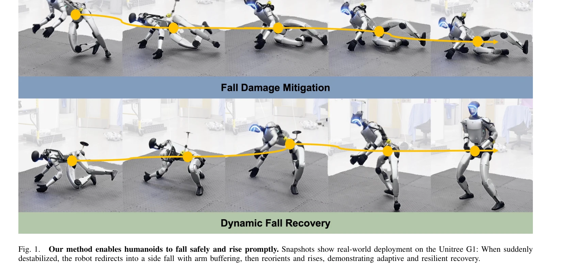
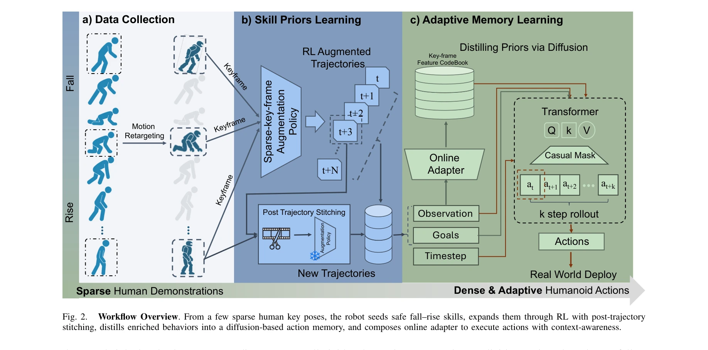

# Unified Humanoid Fall-Safety Policy from a Few Demonstrations

> **저자**: Zhengjie Xu, Ye Li, Kwan-yee Lin, Stella X. Yu | **날짜**: 2025-11-10 | **DOI**: [10.48550/arXiv.2511.07407](https://doi.org/10.48550/arXiv.2511.07407)

---

## Essence

*Fig. 1.*

휴머노이드 로봇이 균형을 잃었을 때 안전하게 넘어지고 빠르게 일어날 수 있도록, 스파스한 인간 시연과 reinforcement learning, diffusion 기반 메모리를 결합하여 낙상 예방·충격 완화·회복을 통합하는 단일 정책을 학습한다.

## Motivation

- **Known**: 기존 휴머노이드 제어는 낙상 회피, 제어된 하강, 일어서기 등을 별도로 다루며, 모델 기반 방법은 단순화된 동역학에 의존하고 RL 기반 방법은 보상 엔지니어링이 어렵고 적응성이 떨어진다.
- **Gap**: 낙상과 회복의 상호연관성을 명시적으로 다루며, 낙상 방지에서 회복까지 전체 과정을 통합하는 단일 정책이 부재한다. 또한 다양한 낙상 모드를 효과적으로 표현하는 방법이 부족하다.
- **Why**: 휴머노이드 로봇의 낙상은 불가피한 위험이며, 안전한 낙상과 신속한 회복은 실제 환경에서의 로봇 배치와 서빙·보조 로봇 활용의 필수 요소이다.
- **Approach**: 인간 시연을 희소 키프레임으로 수집·재타겟팅한 후 RL로 확장하여 안전한 스킬 사전을 구축하고, 이를 diffusion policy로 증류하여 경량 adapter와 함께 실시간 적응 제어를 수행한다.

## Achievement

*Fig. 2.*

- **통합 정책**: 낙상 예방, 충격 완화, 신속한 회복을 단일 정책으로 통합하여 재훈련 없이 세 가지 작업에 적용 가능
- **안전한 스킬 획득**: 스파스한 인간 시연(모션 캡처)에서 밀집된 반응 궤적을 생성하고 RL 기반 확장과 호환 가능한 모션 스티칭으로 다양한 낙상 변형 학습
- **Diffusion 기반 적응 메모리**: 멀티모달 낙상-회복 행동을 diffusion model로 인코딩하고 학습된 특징 예측기로 실시간 온라인 재계획 가능
- **시뮬레이션-현실 전이**: Unitree G1에서 견고한 sim-to-real 전이 달성, 낮은 충격력과 다양한 방해에 걸친 일관되고 빠른 회복 입증

## How

*Fig. 2.*

- 인간 모노큘러 비디오에서 희소 키프레임을 수집하고 G1 로봇 형태로 재타겟팅
- Reinforcement learning으로 키프레임을 밀집된 궤적으로 확장하여 RL 기반 낙상 방지 시드 생성
- 호환 가능한 낙상-회복 모션 쌍을 대상으로 스티칭하고 policy rollout으로 추가 안전 궤적 생성
- 모든 안전 반응을 diffusion policy로 증류하여 멀티모달 분포 학습
- 과거 궤적 데이터에서 다음 안전 목표 포즈를 예측하는 경량 특징 추출기 학습
- 런타임에 특징을 추출하여 메모리 뱅크에서 최근접 이웃 검색, 매 타임스텝마다 겹치는 세그먼트로 안전 궤적 조립

## Originality

- 낙상 예방, 충격 완화, 회복을 **명시적으로 결합**하는 첫 휴머노이드 통합 정책 제안
- 스파스 인간 시연 + RL + diffusion model을 조합하여 **적응적 멀티모달 정책** 구성
- 호환 가능한 모션 스티칭과 **온라인 재계획**으로 다양한 방해에 대한 실시간 적응성 달성
- diffusion 기반 **안전 반응 메모리**로 수백 개의 안전 궤적을 효율적으로 표현하고 검색

## Limitation & Further Study

- 인간 시연 수집이 모노큘러 비디오에 의존하므로 정확한 모션 캡처 데이터 확보의 어려움 존재
- 실험이 단일 로봇 플랫폼(Unitree G1)에만 수행되어 다른 휴머노이드 형태로의 일반화 검증 부족
- diffusion model의 샘플링 시간과 계산 복잡도에 대한 분석 미흡
- 매우 극단적인 방해(예: 높은 에너지 충격) 또는 비정형 지형에서의 성능 한계 미평가
- 후속 연구로 다양한 휴머노이드 형태 및 더 극단적인 시나리오에 대한 확장, diffusion model의 경량화 및 빠른 샘플링 최적화, 실시간 환경 적응 메커니즘 강화 필요

## Evaluation

- Novelty: 4/5
- Technical Soundness: 3/5
- Significance: 4/5
- Clarity: 4/5
- Overall: 4/5

**총평**: 본 논문은 휴머노이드 낙상 완화와 회복을 명시적으로 통합하는 첫 성공적인 통합 정책을 제시하며, 스파스 인간 시연과 RL, diffusion model을 창의적으로 결합하여 안전한 다중 모달 행동을 학습한다. Unitree G1에서의 견고한 sim-to-real 전이와 일관된 성능은 실제 환경에서의 로봇 안전성을 크게 향상시킬 가능성을 보여준다.
